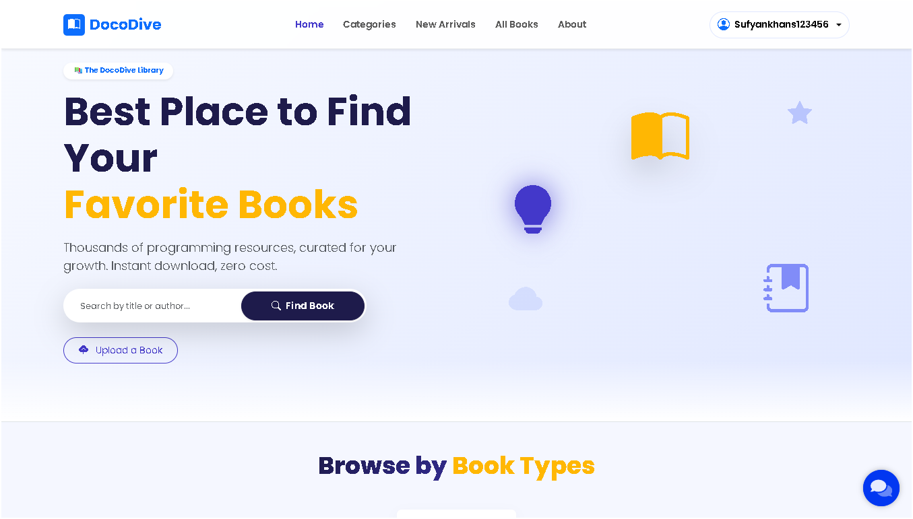
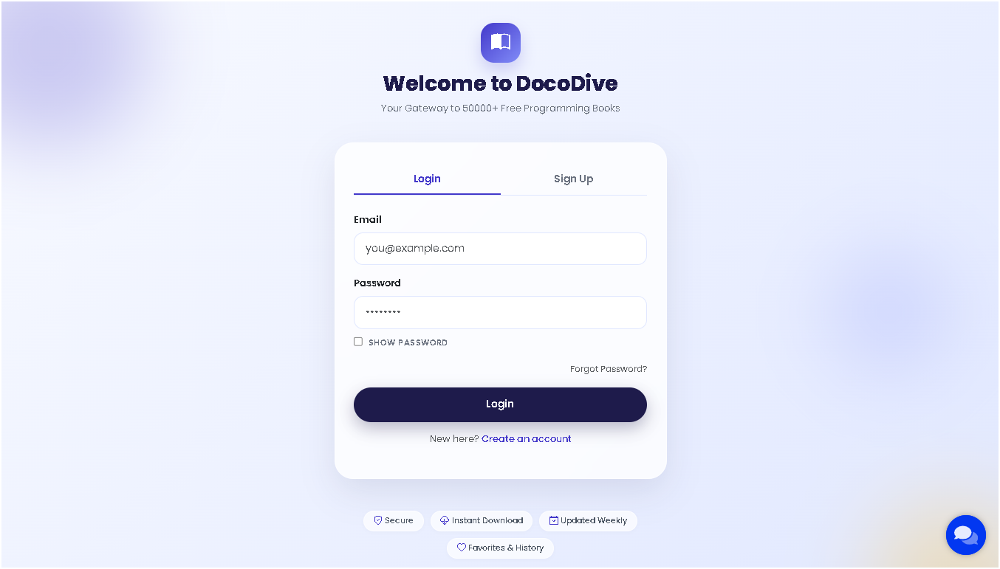

# 📚 DocoDive  
### *Free Knowledge, Pure Discipline*


> **Imagine a digital library where every programming book you’ve ever wanted is just a click away – completely free.**  
> DocoDive is exactly that. It’s a **cloud‑native, open‑source platform** built for developers, by developers.  
> With **TiDB Serverless** as the database, **Cloudflare R2** for file storage, and **Brevo** for emails, it’s ready to scale from your first reader to millions – all without costing you a penny.

---

## 🚀 Why You'll Love DocoDive

✅ **Unlimited Free Books** – Upload PDFs of programming guides, tutorials, and research papers.  
✅ **No Infrastructure Headaches** – TiDB and R2 run on the cloud. You only need to bring your code.  
✅ **Professional Emails** – Verification, password resets, and notifications look stunning.  
✅ **Super‑Admin Control** – Full dashboard to manage users, books, and approvals.  
✅ **Lightning‑Fast UI** – AJAX‑powered interactions keep everything smooth.  
✅ **Fully Responsive** – Looks perfect on phones, tablets, and desktops.  
✅ **Chat Widget** – Integrated Brevo Conversations for live support.  
✅ **Dark Mode** – Elegant dark theme for late‑night reading.

---

## 🧠 How It Works (Step‑by‑Step)

1. **User signs up** → receives a beautiful verification email.  
2. **Email verified** → logs in and browses the library.  
3. **Searches, filters, or scrolls** through thousands of books (categories update live!).  
4. **Opens a book** → sees details, downloads PDF (with progress bar), or reads online.  
5. **Leaves a review** and adds to favorites.  
6. **Forgot password?** → enters email, gets a 4‑digit code inline, verifies it, and receives a reset link – all without a page reload.  
7. **Uploads own PDF** (if logged in) → book goes to pending queue.  
8. **Super‑admin** reviews pending books, approves/rejects with one click – uploader gets notified via email.

---

## 📸 Screenshot

<p align="center">
  
</p>

<h3 align="center" style="color: #ffffff; margin-top: 1.5rem;">
  ✨ Welcome to DocoDive ✨
</h3>

<p align="center" style="color: #2725b8; font-size: 1rem; max-width: 600px; margin: 0 auto;">
  Browse thousands of free programming books, download instantly, and build your own library – all in one beautifully designed platform.
</p>

## 🔐 Login Page

<p align="center">
  
</p>

<p align="center" style="font-size: 1.1rem; color: #ffffff;">
  <strong>One click to your library.</strong><br>
  Sign in, verify instantly, or reset your password – all wrapped in a clean, modern interface.
</p>

---
## 🚧 Roadmap

We're constantly improving DocoDive. Here’s what’s coming next:

- [ ] **Full‑text Search** – Elasticsearch or TiDB’s native full‑text capabilities for instant book discovery.
- [ ] **Subscription & Donations** – Monetise your library or accept community support seamlessly.
- [ ] **Native Mobile App** – Android & iOS apps (the PWA already works great on mobile).
- [ ] **AI‑Powered Recommendations** – “You might also like…” powered by Gemini.
- [ ] **Public REST API** – Allow third‑party apps to fetch book metadata and stats.
- [ ] **User Profiles** – Custom avatars, bios, and reading history.

> Got a feature idea? [Open an issue](https://github.com/yourusername/docodive/issues) and let’s discuss!

---
## 🤝 Contributing

Contributions are what make the open‑source community incredible.  
We welcome **any improvements** – from fixing typos to building major features.

### How to Contribute

1. **Fork** the repository  
   Click the `Fork` button at the top‑right of the repo page.

2. **Create a feature branch**  
   ```bash
   git checkout -b feature/amazing-feature

---
## 🙏 Acknowledgements

DocoDive would not exist without the incredible open‑source ecosystem and cloud services that power it.  
A massive thank you to:

- **[Flask](https://flask.palletsprojects.com/)** – the lightweight and flexible Python web framework.
- **[TiDB Cloud](https://tidbcloud.com/)** – serverless, MySQL‑compatible database with effortless scaling.
- **[Cloudflare R2](https://www.cloudflare.com/products/r2/)** – S3‑compatible object storage, generous free tier included.
- **[Brevo (formerly Sendinblue)](https://www.brevo.com/)** – reliable transactional email service with 300 free emails/day.
- **[Bootstrap 5](https://getbootstrap.com/)** – powerful frontend framework for responsive, beautiful UIs.
- **[Bootstrap Icons](https://icons.getbootstrap.com/)** – crisp, consistent icon set.
- **[PyPDF2](https://pypi.org/project/PyPDF2/)** – PDF metadata and text extraction.
- **[Werkzeug](https://werkzeug.palletsprojects.com/)** – secure password hashing and WSGI utilities.
- **[Google Gemini](https://ai.google.dev/)** (optional) – AI‑powered title and author enhancement.
- **[MySQL Connector/Python](https://dev.mysql.com/doc/connector-python/en/)** – pure Python MySQL driver for TiDB.
- **[Flask‑Mail](https://pythonhosted.org/Flask-Mail/)** – email integration for Flask.
- **[Python‑Dotenv](https://pypi.org/project/python-dotenv/)** – environment variable management.
- **[Poppins Font](https://fonts.google.com/specimen/Poppins)** – clean and modern typography.
- All the **open‑source contributors** who share their knowledge freely.

> If you’d like to support DocoDive, a ⭐ on GitHub means the world!  
> And if you’ve contributed code, ideas, or feedback – you’re already part of this journey. 💙

## 🧰 Tech Stack

| Category          | Technology |
|-------------------|------------|
| **Backend**       | Python + Flask |
| **Database**      | TiDB Serverless (MySQL‑compatible, auto‑scaling) |
| **File Storage**  | Cloudflare R2 (S3‑compatible, 10 GB free) |
| **Email**         | Brevo (formerly Sendinblue) – 300 free emails/day |
| **Frontend**      | HTML5, CSS3, JavaScript, Jinja2 templates |
| **UI Framework**  | Bootstrap 5 + Bootstrap Icons |
| **PDF Processing**| PyPDF2 (metadata & text extraction) |
| **AI (optional)** | Google Gemini API – auto‑enhance book titles |
| **Security**      | Werkzeug password hashing (scrypt), SSL/TLS for all connections |
| **Chat**          | Brevo Conversations widget |
| **Deployment**    | Render, Railway, or any WSGI server |

---

## ⚡ Quick Start

Get DocoDive running locally in **5 minutes**.  
Every command below can be copied with a single click – just hover over the code block and hit the 📋 icon.

---

### 📦 Prerequisites

- Python **3.10+** and pip
- Git
- A [TiDB Serverless](https://tidbcloud.com) cluster (free tier available)
- A [Cloudflare R2](https://developers.cloudflare.com/r2/) bucket (10 GB free)
- A [Brevo](https://www.brevo.com/) account (300 free emails/day)
- (Optional) A Google Gemini API key for AI‑powered metadata

---

### 🛠️ Step‑by‑Step Installation

1. **Clone the repository**
   ```bash
   git clone https://github.com/programmingpioneer/docodive.git && cd docodive