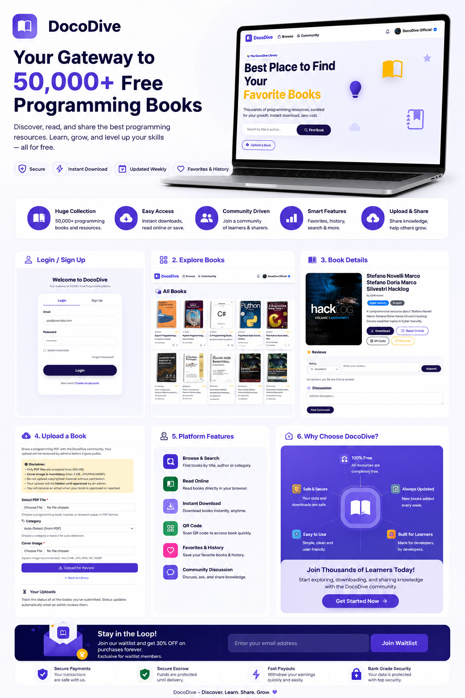

<div align="center">

# ⚡ DOCODIVE — The Cloud-Native Programming Vault

### *Free Knowledge • Pure Discipline • Built by Pioneers*

[](https://www.python.org/)
[](https://flask.palletsprojects.com/)
[](https://tidbcloud.com/)
[](https://www.brevo.com/)
[](https://www.cloudflare.com/)
[](LICENSE)

> **Executive Summary:** DocoDive is a fully scalable, cloud-native open-source digital library engineered to distribute programming literature without infrastructure cost barriers. Utilizing serverless architecture, object storage decoupling, and enterprise-grade transactional messaging, it bridges the gap between high-performance web engineering and open access.

</div>

---

## 🎯 Project Overview & Objectives

Traditional digital libraries suffer from heavy server loads, costly storage bottlenecks, and weak security. **DocoDive** solves these engineering challenges through a modern decoupled architecture:

- **Zero Cost Scaling:** Built entirely on serverless and edge cloud tiers to handle user traffic spikes natively.
- **Rigorous Data Integrity:** Enforces strict user session handling, profile verification, and community moderation workflows.
- **Production-Grade Security:** Implements scrypt password hashing, secure environment variables, and strict form validation gates.

> 🌐 **Experience It Live:** Don't just read the code—test out the fully deployed production platform right now: [🔗 Launch DocoDive Live](https://docodive-library.onrender.com/)

---

## 🛠️ Core Engineering Systems

| Subsystem | Technology Used | Implementation Purpose |
| :--- | :--- | :--- |
| **Backend Core** | Python, Flask, Werkzeug | RESTful routing, session management, secure credential hashing. |
| **Primary Database** | TiDB Serverless (MySQL Compatible) | Distributed relational storage with auto-scaling capabilities. |
| **Asset Storage** | Cloudflare R2 (S3-Compatible) | High-speed, zero-egress fee PDF binary storage. |
| **Messaging & CRM** | Brevo API | Transactional email delivery (verification/reset tokens) & live support routing. |
| **Frontend UI** | Bootstrap 5, Jinja2, AJAX | Responsive cross-device layout with dynamic asynchronous page components. |

---

## 🚀 Evolution: From a Simple Library to a Complete Community Platform

Every feature below was built incrementally, turning DocoDive into a robust, self-moderating ecosystem. Here's what we've shipped:

### 📚 Core Library Foundation

- **Unlimited PDF Uploads** – Admins and users can upload programming books with automatic category detection and duplicate checking.
- **Powerful Search & Filters** – Search by title, author, category, or language with live AJAX suggestions.
- **Book of the Day** – A fresh recommendation every 24 hours, generated dynamically.
- **Personalized Recommendations** – Based on user favorites and download history.
- **Favorites, History & Reviews** – Readers build their own library, track downloads, and leave star ratings with comments.
- **Read Online** – Embedded PDF viewer for instant access.

### 🔎 Smart Search Experience

- **Smart Live Search Suggestions** – As users type each word, matching books are dynamically found using title and author data and displayed in the suggestion dropdown.
- **Find Book Button Loading** – The loading spinner appears directly inside the **Find Book** button instead of replacing the search suggestions area.
- **Horizontal Search Result Slider** – When 5 or more matching books are available, results are displayed in a horizontal slider with left and right navigation controls.
- **Smooth Suggestion Animations** – Search suggestion items appear with smooth fade-in animations for a cleaner and more responsive experience.

### 🔐 Identity & Security

- **Email Verification** – Beautiful verification emails via Brevo; accounts activated with one click.
- **Forgot Password Flow** – Inline AJAX-based code entry followed by a secure tokenised reset link.
- **Streaks & Points** – Gamified daily login streaks and points for community activity.
- **User Profiles** – Custom avatars, bios, social links; stats like uploads, reviews, and favorites.
- **First & Last Name Enforcement** – Mandatory fields during signup for a clean user audit trail.

### 👑 Official Community Account & Moderation

- **Blue Verified Tick (✔️)** – A dedicated official account, set by super-admins, displays a verification badge everywhere (navbar, reviews, comments, leaderboard, notifications).
- **Clickable Official Profile** – Only the official account's name links to its public profile, highlighting its authority.
- **Community Moderation Panel** – `/moderation` route accessible to admins and the official account. Displays recent reviews and comments in a table with inline delete and official reply options.
- **Inline Moderation on Book Pages** – Admins and the official account can delete any review or discussion comment and reply officially without leaving the page.
- **Leaderboard Integrity** – Official accounts are excluded from the leaderboard; their personal stats (uploads, points) are hidden on their profile page, keeping the competition fair for standard users.

### 💬 Live Chat & CRM Integration

- **Brevo Conversations Widget** – Built-in live chat that captures visitor identity via a pre-chat form (name & email) before the conversation begins, automatically saving them as contacts in your Brevo CRM.
- **No Anonymous Chats** – Every support request is linked to a real identity, improving support team efficiency.

### 🧠 Intelligent Automation

- **AI-Enhanced Metadata** – Optional Gemini integration automatically improves book titles, author names, and descriptions during upload.
- **Automatic Category Detection** – PDF text analysis assigns the correct category without manual input.
- **Duplicate Book Detection** – Fuzzy matching prevents identical books from being uploaded twice.

### 📊 Dashboard & Analytics

- **Admin Dashboard** – Real-time stats on books, users, admins, and categories; pending book counts; charts for library overview and category distribution.
- **Recent Uploads & Login Logs** – Super-admins can monitor activity and audit login attempts.
- **Super-Admin User Management** – Create, edit, or delete admin accounts directly from the dashboard.

---

## 📈 Feature Implementation Summary

| Category | Implemented Features |
| :--- | ---: |
| 📚 Core Library Foundation | 6 |
| 🔎 Smart Search Experience | 4 |
| 🔐 Identity & Security | 5 |
| 👑 Official Community & Moderation | 5 |
| 💬 Live Chat & CRM | 2 |
| 🧠 Intelligent Automation | 3 |
| 📊 Dashboard & Analytics | 3 |
| **🚀 Total Implemented** | **28** |

---

## 🧠 System Workflow & Logic

1. **Onboarding:** User registers with First Name, Last Name, and Email → System triggers an asynchronous verification dispatch via Brevo.
2. **Access Control:** Verified users authenticate → Session tokens map directly to database states.
3. **Discovery & Retrieval:** Real-time search filters query TiDB → Client fetches metadata asynchronously via AJAX.
4. **Smart Search Interaction:** User types a search query → Matching title/author suggestions appear dynamically → Results can be explored through the horizontal slider.
5. **Binary Delivery:** PDF downloads route directly through Cloudflare R2 object storage with progress tracking.
6. **Community Engagement:** Users leave reviews or upload documents → Submissions enter a pending moderation queue awaiting administrator approval.

---

## 📸 System Visual Preview

### 🛠️ Administrative Control Dashboard

<p align="center">
  <a href="https://docodive.programmingpioneer.com" target="_blank">
    
  </a>
</p>

<p align="center">
  <i>Click the image above to explore the live dashboard.</i><br>
  Manage books, users, reviews, and official community settings from a single powerful interface.
</p>

---

## 🗺️ Project Roadmap

DocoDive will continue evolving from a free programming library into a complete learning, practice, and developer community platform.

**📚 Library → 🎓 Courses → 💻 Practice Hub → 🏆 Gamification → 👥 Community → 💰 Marketplace → 🤖 AI → 🌍 Global Platform**

### ✅ Completed

- [x] **Unlimited PDF Uploads**
- [x] **Search by Title, Author, Category & Language**
- [x] **Live AJAX Search Suggestions**
- [x] **Book of the Day**
- [x] **Personalized Recommendations**
- [x] **Favorites, History & Reviews**
- [x] **Read Online PDF Viewer**
- [x] **Email Verification via Brevo**
- [x] **Forgot Password Flow**
- [x] **Daily Streaks & Points**
- [x] **User Profiles**
- [x] **First & Last Name Enforcement**
- [x] **Blue Verified Tick**
- [x] **Clickable Official Profile**
- [x] **Community Moderation Panel**
- [x] **Inline Book Page Moderation**
- [x] **Leaderboard Integrity**
- [x] **Brevo Conversations Live Chat**
- [x] **Pre-Chat Form & CRM Contact Integration**
- [x] **No Anonymous Chats**
- [x] **Gemini AI-Enhanced Metadata**
- [x] **Automatic Category Detection**
- [x] **Duplicate Book Detection**
- [x] **Admin Dashboard**
- [x] **Recent Uploads & Login Logs**
- [x] **Super-Admin User Management**
- [x] **Smart Live Search Suggestions**
- [x] **Find Book Button Loading**
- [x] **Horizontal Search Result Slider**
- [x] **Smooth Suggestion Fade-In Animations**
- [x] **Responsive Search Suggestions Scrollbar**
- [x] **SEO Metadata in `base.html`**
- [x] **Google Analytics 4 Integration**
- [x] **Sitemap XML**
- [x] **Robots.txt**
- [x] **Book Detail JSON-LD Structured Data**
- [x] **Service Worker**
- [x] **Main JavaScript Integration**
- [x] **Performance Optimization**
- [x] **Live Production Deployment**
- [x] **TiDB Serverless Database**
- [x] **Cloudflare R2 PDF Storage**
- [x] **Brevo Email & CRM Infrastructure**

### 🚧 Planned & Future Features

- [ ] **Full-text Search Engine Integration** – Advanced book and document search using Elasticsearch or TiDB full-text indexing.

- [ ] **Online Courses & Digital Learning Marketplace** – Allow users to discover and purchase programming courses and digital learning content through secure online transactions.

- [ ] **Worldwide Payment Support** – Support international payment methods for users around the world, enabling secure cross-border course and digital-content purchases.

- [ ] **Pakistan Payment Integration** – Add locally accessible payment methods such as Easypaisa and Pakistani banking/payment gateways for users in Pakistan.

- [ ] **Automated Donation & Sponsorship Module** – Allow the community to support DocoDive through donations and sponsorships.

- [ ] **AI-Powered Semantic Recommendations** – Provide intelligent book and learning-content recommendations based on user interests, activity, and learning history.

- [ ] **Programming Language Learning Hubs** – Create dedicated learning pages and resource collections for major programming languages such as Python, JavaScript, Java, C++, C#, PHP, Go, Rust, and others.

- [ ] **Programming Practice Hub** – Build an interactive practice environment where users can solve programming problems, write code, test solutions, and improve their problem-solving skills.

- [ ] **Practice Problems & Challenges** – Introduce categorized programming challenges ranging from beginner exercises to advanced algorithmic problems.

- [ ] **Programming Language-Specific Practice** – Provide separate practice tracks for different programming languages so users can practice concepts using the language they are learning.

- [ ] **Coding Progress Tracking** – Track solved problems, completed challenges, learning progress, and practice activity for each user.

- [ ] **Streak Leaderboard** – Introduce a dedicated leaderboard for daily learning and coding streaks.

- [ ] **Global Community Leaderboard** – Rank users based on meaningful community activity such as learning progress, practice achievements, reviews, contributions, and streaks.

- [ ] **Updated Streaks & Leaderboard Pages** – Redesign and improve streak and leaderboard pages with better statistics, rankings, progress information, and user experience.

- [ ] **Monthly Ranking Awards** – Introduce monthly community rankings with awards and recognition for top learners, contributors, and active community members.

- [ ] **Achievement & Badge System** – Award badges for milestones such as completing learning tracks, solving programming challenges, maintaining streaks, contributing resources, and reaching ranking milestones.

- [ ] **Monthly Community Awards** – Recognize outstanding users every month for categories such as Top Learner, Top Contributor, Coding Champion, and Community Star.

- [ ] **Developer Profiles 2.0** – Expand user profiles into developer-focused profiles showing learning progress, programming skills, achievements, solved challenges, streaks, badges, and community contributions.

- [ ] **Learning Progress Dashboard** – Provide users with a central dashboard for tracking books read, courses completed, problems solved, streaks, achievements, and overall learning progress.

- [ ] **Personal Learning Paths** – Allow users to follow structured learning paths such as Python Beginner → Python Advanced → Data Structures → Algorithms → Projects.

- [ ] **Course Progress & Certificates** – Track course completion and provide certificates or completion records for eligible learning programs.

- [ ] **Project-Based Learning** – Add practical programming projects and guided project challenges so users can apply what they learn.

- [ ] **Community Discussions** – Introduce dedicated discussions around books, programming languages, courses, coding problems, and learning topics.

- [ ] **Code Sharing & Solutions** – Allow users to share programming solutions, explanations, and alternative approaches to practice problems.

- [ ] **Mentorship & Community Learning** – Build features that allow experienced developers and advanced learners to help other members through community-based learning.

- [ ] **Advanced Notifications Center** – Notify users about new courses, achievements, leaderboard positions, streak milestones, replies, awards, and important account activity.

- [ ] **Personalized Home Dashboard** – Create a personalized homepage showing recommended books, courses, practice problems, active streaks, progress, and community rankings.

- [ ] **Advanced Admin Analytics** – Expand the administration system with detailed analytics for users, books, courses, purchases, learning activity, practice activity, and community engagement.

- [ ] **Course Creator System** – Allow approved instructors or administrators to create, manage, publish, and update programming courses.

- [ ] **Instructor & Creator Profiles** – Introduce dedicated profiles for course creators and community educators.

- [ ] **Secure Digital Content Delivery** – Protect purchased courses and digital learning materials with authenticated access and controlled content delivery.

- [ ] **Multi-Language Learning Support** – Expand the platform to support learning resources and educational content in multiple languages.

- [ ] **Mobile-First Learning Experience** – Further optimize reading, learning, practice, dashboards, and community features for mobile devices.

- [ ] **DocoDive API** – Provide a secure API layer for future integrations, developer tools, educational applications, and third-party services.

- [ ] **Developer Tools & Utilities Hub** – Add useful online tools for programmers such as formatters, converters, generators, validators, and other development utilities.

- [ ] **Advanced Recommendation Engine** – Combine user activity, interests, learning progress, and community behavior to provide more relevant educational recommendations.

- [ ] **AI Learning Assistant** – Introduce an AI-powered assistant that can help users understand programming concepts, explain errors, and guide them through learning resources.

- [ ] **Scalable Cloud Infrastructure** – Continue improving the architecture for higher traffic, larger libraries, more users, and global availability.

- [ ] **Internationalization & Global Expansion** – Prepare DocoDive for users, creators, and educational communities across different countries and regions.
---

## 🤝 Contributing

We welcome contributions that push the boundaries of open-source education:

1. **Fork** the repository

2. **Create a feature branch**

   ```bash
   git checkout -b feature/amazing-feature
---
## 👤 About the Creator

<div align="center">

### **Sufyan Khan**
*Full-Stack Engineer & Open-Source Builder*

</div>

Yo! I’m **Sufyan Khan** — a developer who decided that instead of just waiting around for a degree to start building, I was going to roll up my sleeves and ship real production code. 

Fresh out of my FSc studies, I architected and built **DocoDive** entirely from scratch. We're talking serverless databases, cloud-native object storage, automated email pipelines, and real security infrastructure—all engineered to solve a real problem without spending a single dollar on server costs.

My mindset is simple: **Pure Discipline.** No excuses, no shortcuts, just relentless execution. If you want something built right, you build it yourself.

> *"From studying FSc textbooks to architecting cloud-native systems—this is just chapter one."*

<div align="center">

[](https://github.com/yourusername)
[](https://linkedin.com/in/yourusername)

</div>